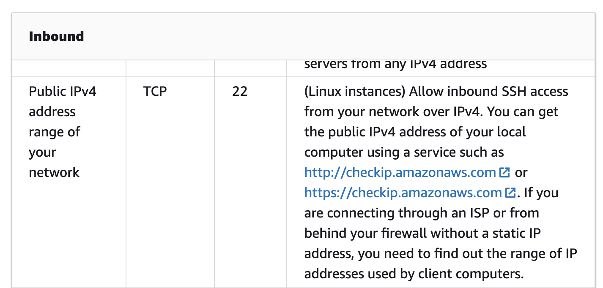
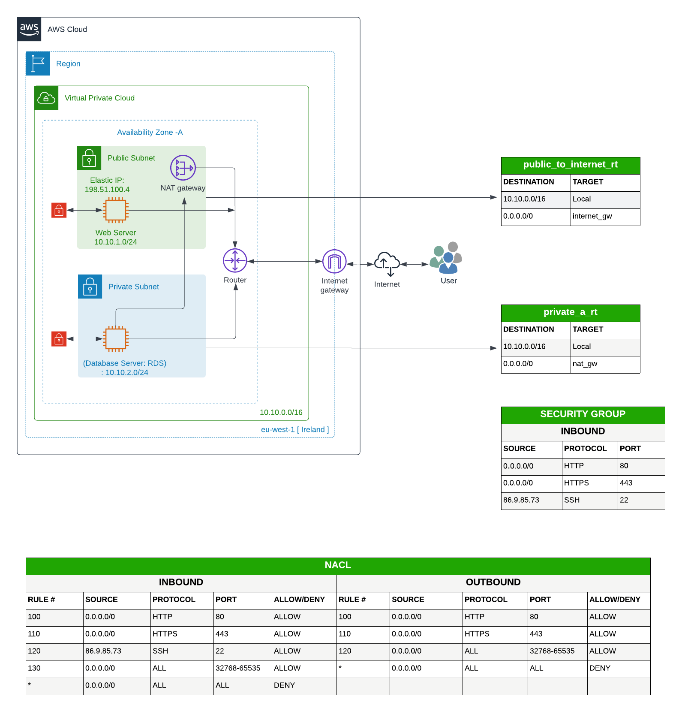
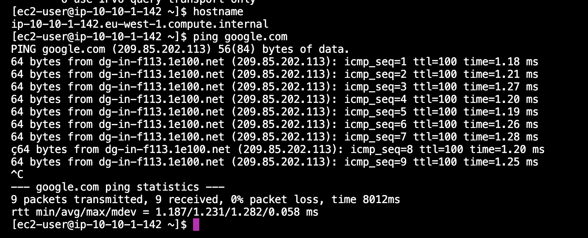

## AWS Documentation
**VPC with a single public subnet - Amazon Virtual Private Cloud**

[Link to AWS Documentation on VPC](https://docs.aws.amazon.com/vpc/latest/userguide/VPC_Scenario1.html)

* Ssh on security group - your personal ip address - on google - whats my ip - i.e. 86.9.85.73
    * *Note: Don't use the Amazon version* 

 
 
 
## 1. The Architectural Diagram

 
 
 
## 2. AWS Management Console 
- Management Console - create each * section - Do not use 'Default'
* Log in to AWS Management Console
* Change region to eu-west-1

#### **Creating a VPC**
* Go to the service and search for VPC
* Click on VPC - DO NOT CLICK ON VPC WIZARD
    * On the left hand panel --> click on Your VPC 
    * Click on 'Create VPC'
	* Under the VPC Settings
	    * Select VPC only
		* Give a name to your VPC - i.e. vpc_demo
		* IPv4 CIDR Block - i.e. 10.10.0.0/16
		* No IPv6 CIDR block
	* Choose Create VPC

#### **Creating the Internet Gateway**
* On the left hand panel click on Internet Gateways
* Click on Create internet gateway
* Under the internet gateway settings
	* Give it a name - i.e. Internet_gw
* Create internet gateway
* Once created - on the top right hand corner with a green banner --> Attach to a VPC --> Select your VPC name from the drop down list (i.e. vpc_demo)
* Click on Attach internet gateway

#### **Creating the Public Subnet**
* On the left hand panel click on Subnet
* Click on Create subnet
	* VPC ID --> Select your VPC i.e. vpc_demo
	* Subnet name i.e. public_cidr_a
	* Select the Availability Zone - i.e. Europe(Ireland) / eu-west-1a
	* IPv4 CIDR block - i.e. 10.10.1.0/24
* Click on Create subnet

#### **Creating the Public Route Table**
* On the left hand panel click on Route Table
* Click on Create route table
*VPC --> Select your VPC i.e. vpc_demo
* Click on Create route table

* Click on the Routes --> Edit routes
    * Add Route
	* 0.0.0.0/0
	* Type internet gateway
* Save changes 

* Click on the Subnet associate tab 
	* Edit subnet associations
	* Select the public subnet - i.e. public_cidr_a
* Save associations 

#### **Auto assign Public IP - SSH access**
* On the left hand panel click on Subnet
* Select the public subnet -i.e. public_cidr_a
* Action --> Edit subnet settings
* Under Auto-assign IP settings --> Check (Tick) Enable auto-assign public IPv4 address
* Save 

#### **Create a Key Value Pair**
* On the AWS Icon on the left hand side, right-click and open link in new tab
* Go to the service and search for EC2
* On the left hand panel scroll down to Network & Security --> Key Pairs
* Create key pairs
	* Name - i.e. vpc_demo_kp
	* Key pair type - RSA
	* Private key file format - .pem
* Create key pair
* The key pair file will download 
* Go to your user hidden files --> command + Shift + . --> It will show all the hidden files, search for ssh folder and paste your key pair file in this folder

#### **Creating an EC2 machine with t2.micro**
* Search for IAM
* Click on Roles --> Create role
    * AWS Service
    * Use case: EC2
    * Permission --> search for AmazonS3FullAccess
    * Role name --> VPC-EC2-S3-Role
* Create role

* **Go back to the EC2  - Make sure the region is correct - eu-west-1**
* On the left hand panel click on Instances
* Launch instances
	* Give it a name - i.e. webserver
	* Instance type - t2.micro
	* Select the key pair -- vpc_demo_kp
	* Network settings
		* Create security group
		* Security group Name - vpc_public_sg 
		* Security group --> ssh 0.0.0.0/0
* Launch instance

#### **SSH into the instance**
* Select the instance - select webserver
* Copy the public IPv4 -- i.e. 34.252.69.240
* Open the terminal
* Go to the path where the key pair is stored and change permission by typing the command
	* chmod 400 vpc_demo_kp.pem
* i.e. ~/.shh --> you can type ll -al
* Type the above command -- chmod 400 vpc_demo_kp.pem
* Type - ssh -i vpc_demo_kp.pem ec2-user@34.252.69.240  --> yes
	* You can type hostname -- to check host --> ip-10-10-1-142.eu-west-1.compute.internal -- this is the private ip address
* Now check if we can connect to the internet by ping google.com
    * Type ping google.com

    

* When you type aws s3 ls --> you will get an error -- Unable to locate credentials. You can configure credentials by running "aws configure".

#### **Select the private_instance - Assigning IAM Role**
* Go back to the EC2 instance --> Security -- you will see that the IAM Role is blank
* Go to Action --> Security --> Modify IAM role --> IAM Role -- select VPC-EC2-S3-Role 
* Update 
* Go back to the terminal --> type aws s3 ls

#### **Creating the Private Subnet**
* Go to your VPC -- search for VPC
* On the left hand panel click on Subnet
* Create subnet
	* VPC ID --> Select your VPC i.e. vpc_demo
	* Subnet name i.e. private_cidr_a
	* Select the Availability Zone - i.e. Europe(Ireland) / eu-west-1a
	* IPv4 CIDR block - i.e. 10.10.2.0/24
* Click on Create subnet

#### **Creating the Private Route Table**
* On the left hand panel click on Route Table
* Click on Create route table
	* Name i.e. private_nat_gw_rt
	* VPC --> Select your VPC i.e. vpc_demo
* Click on Create route table
* Click on the Subnet associate tab 
	* Edit subnet associations
	* Select the public subnet - i.e. private_cidr_a
* Save associations 

* **Go back to the EC2  - Make sure the region is correct - eu-west-1**
* On the left hand panel click on Instances
* Launch instances
	* Give it a name - i.e. private_instance
	* Instance type - t2.micro
	* Select the key pair -- vpc_demo_kp
	* Network settings
	* By default the vpc and the private subnet should be automatically selected.
		* Create security group
		* Security group Name - vpc_private_sg 
		* Security group --> ssh, source type: custom, select the public sg from the list
* Launch instance

#### **Go back to the terminal**
* i.e. ~/.shh --> if you already in a connection, you can close the connection by typing exit 
* Type more vpc_demo_kp.pem
* Copy the key -- example
			
* Go back to the public ec2 instance -- ssh -i vpc_demo_kp.pem ec2-user@34.252.69.240
* Type vi vpc_demo_kp.pem
	* Paste the above private key to this file -- save and exit
	* chmod 400 vpc_demo_kp.pem
	* Type ping google.com
	* You can list the bucket --> aws s3 ls

* **Go back to the EC2  - Make sure the region is correct - eu-west-1**
    * Left hand side --> instances
    * Select private_instance
	    * Note there's no public IPv4 
	    * Copy Private IPv4 addresses --> i.e. 10.10.2.86

* **Go back to the terminal**
    * Go to the private ec2 instance -- ssh -i vpc_demo_kp.pem ec2-user@10.10.2.86

* **Select the private_instance - Assigning IAM Role**
    * Go to Action --> Security --> Modify IAM role --> IAM Role -- select VPC-EC2-S3-Role 

